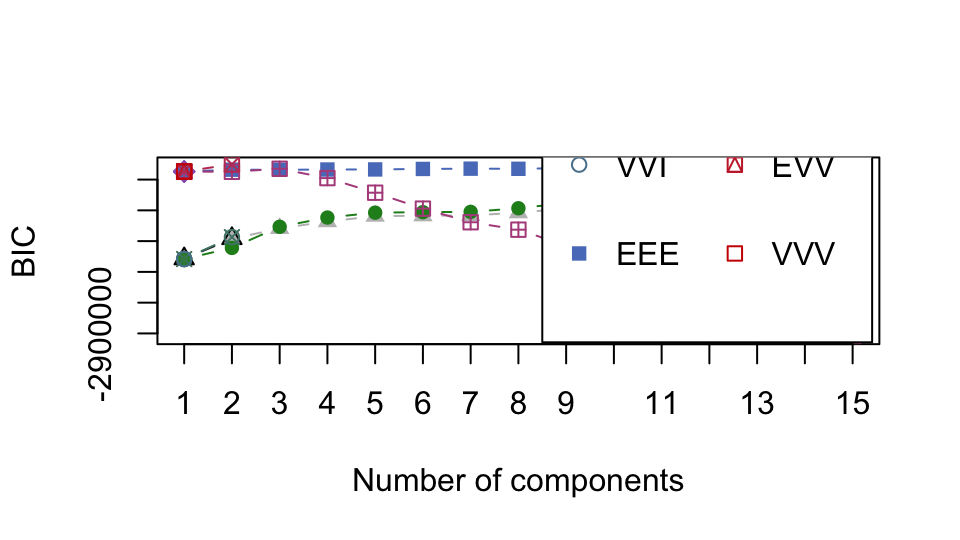

```{r include=FALSE, eval=TRUE}
source("common.R")
library(tidyverse)
```

# Cluster analysis {#cluster}

## Data preparation 

For the purpose of demonstration we will be using a subsample from the larger data set. 
```{r}
set.seed(133)
n = 200
val_sub <- data_val %>%
  drop_na() %>% 
  group_by(country) %>% sample_n(n) %>% ungroup %>% dplyr::select(-country)
```

```{r message=FALSE}
#libraries for this chapter
library(cluster)    # clustering algorithms
library(factoextra) # clustering algorithms & visualization
```
 
 The data pre-processing involves two main steps:
 - remove variables with near zero variance
 - scale the data (Z-scores with mean as the center, and sd for spread); one could potentially make an argument for using mean average deviation for estimating the spread of the data. 
 
```{r}
val_sub <- val_sub[,-caret::nearZeroVar(val_sub)] #remove columns with near zero variance - we have already removed the columns with near zero variance so we move to the next step. 
val_sub<- val_sub %>% scale
```

```{r}
#Let's take a look at the data 
df <- val_sub %>% data.frame() 
df %>% 
   mutate_if(is.numeric, ~round(., 2)) %>% 
   reactable()
```

## K-means Clustering 
This type of Clustering involves minimizing the within cluster variation. Hartigan and Wong(1979) provided the following algorithm for K-means Clustering 

$$W(C_k) =  \sum_{x_1 \in C_k}(x_i-μ_k)^2$$
where $x_i$ is a data point in cluster $C_k$ and $μ_k$ is the mean of all values in cluster $C_k$.To put it simply, _Clustering_ is an optimization algorithm which and _k-means_ is one variant which tries to build coherent clusters that minimize within cluster dissimilarity.  

### How to specify the number of clusters?
\n
One of the important questions across dimension reduction techniques involves how many dimensions are the most optimal to describe the data at hand. This is essentially what we intend to do when we want to identify the groups in the data given the features. In our case the features involve the use variables in the World Value Survey. 


- **Method WSS**: The within cluster dispersion of data, also know as the _error measure_, is likely to drop more prominently after some clustering value. This creates a "elbow" like visual on the plot which is utilized to indicate the optimal number of clusters to model the data. 

```{r}
fviz_nbclust(val_sub, kmeans, method = "wss", k.max = 50, nboot = 200) + theme_minimal() + ggtitle("Method: WSS [Elbow method] ")+ geom_vline(xintercept = 5, linetype = 2)

```

- **Method: Silhoutte**: This method determines the appropriateness of a data point in a cluster. In other words, it computes how similar an observation is to a given cluster as compared to neighboring clusters. 
It computes average silhoutte of observations for varying _k_ values. the _k_ configuration is dependent on the values assigned to the observations across clusters, if these values are high the _k_ or the number of clusters is seen as the appropriate value for structuring the data. 
```{r}
fviz_nbclust(val_sub, kmeans, method = "silhouette")+ theme_minimal() + ggtitle("Method: Silhouette")
```

- **Method: Gap stat**: This method computes pooled within cluster sum of squares and compares it to a null model of a single component. 
```{r}
fviz_nbclust(val_sub, kmeans, method = "gap_stat")
```


- **Sum of square **: This method relies on minimizing the within cluster variance and increasing between cluster variance. 

```{r}
#Function to run this algorithm on 

pull_vals <-  function(n_center){
  
  n_center <- {{n_center}}
  withinness <- mean(kmeans(val_sub, center = {{n_center}})$withinss)
  betweenness <-  kmeans(val_sub, center = {{n_center}})$betweenss
  
   l = list(n_center, withinness, betweenness) 
   names(l) <- c("n_center", "withinness", "betweenness")
      return(l)
  }

ssc <- map_df(1:40, pull_vals)

plot_ssc <- ssc %>%
  gather(., key = "measurement", value = value, -n_center) 
```

```{r}
plot_ssc%>% 
    ggplot(aes(x=n_center, y=log10(value), fill = measurement)) +
       geom_bar(stat = "identity", position = "dodge", alpha = .8) +     
       labs(x = "Number of Clusters", 
            y = "Log10 Total Sum of Squares", 
            title = "Cluster Model Comparison") +
       scale_x_discrete(name = "Number of Clusters", limits = paste0(1:40)) +
  geom_hline(aes(yintercept = 4.5), linetype = 3, size = .2, alpha = .5)+
       theme_minimal()
```

As you can see in the plot above, the WSS drop as the number of clusters increase. It keeps dropping even when the cluster size is 40. The graph indicates that the between cluster variance does not increase by much after _k_ = 35. We can consider this as an approximate of the value of optimal _k_ for the data. 

- **Method: Bayesian Inference Criterion [BIC]**
```{r eval=FALSE}
library(mclust)
d_clust <- Mclust(as.matrix(val_sub), G=1:15, 
                  modelNames = mclust.options("emModelNames"))

plot(d_clust)
```

```{r include=FALSE}

```

- **Method: Average of 30 indices **
The  `NbClust` package in R contains up to 30 indices (for example, Hartigan (1975),Ratowsky and Lance(1978), etc. ) for determining the number of appropriate clusters.
```{r eval=FALSE, warning = F}
#Check with Talapas 
library(NbClust)
# res.nbclust <- NbClust(val_sub, distance = "euclidean", min.nc = 2, max.nc = 9, method = "complete", index ="all")
# 
# factoextra::fviz_nbclust(res.nbclust) + 
#    ggtitle("NbClust's optimal number of clusters") + theme_minimal()

res.nbclust_15 <- NbClust(data, distance = "euclidean", min.nc = 2, max.nc = 15,method = "complete", index ="all")

factoextra::fviz_nbclust(res.nbclust) + 

res.nbclust_15 <- NbClust(val_sub, distance = "euclidean", min.nc = 2, max.nc = 15,method = "complete", index ="all")

factoextra::fviz_nbclust(res.nbclust_15) + 

   ggtitle("NbClust's optimal number of clusters") + theme_minimal()

res.nbclust_15$Best.nc %>% as_tibble() %>% pivot_longer(cols = KL:SDbw,  names_to = "index") %>% slice(1:26) %>% count(value) %>% 
  ggplot(aes(x = factor(value), y = n))+
  geom_col(fill = "#F08080", alpha = .8)+
  theme_minimal() +
  labs(title = "NbClust's optimal number of clusters", 
       x = "Number of clusters k",
       y = "Frequency among all indices")
  
```

- **Hierarchical clustering** 
We will set the distance method to `euclidean`. The linkage method we will be using here is the `average` linkage method. 
```{r eval=FALSE}
dist_mat <- dist(val_sub, method = 'euclidean')
hclust_avg <- hclust(dist_mat, method = 'average')
#plot(hclust_avg) - aborts session, data is too big 
```

- **Cluster tree**
```{r}
library(clustree)
tmp <- NULL
for (k in 1:11){
  tmp[k] <- kmeans(val_sub, k, nstart = 30)
}
df <- data.frame(tmp)
# add a prefix to the column names
colnames(df) <- seq(1:11)
colnames(df) <- paste0("k",colnames(df))
# get individual PCA
df.pca <- prcomp(df, center = TRUE, scale. = FALSE)
ind.coord <- df.pca$x
ind.coord <- ind.coord[,1:2]
df <- bind_cols(as.data.frame(df), as.data.frame(ind.coord))
clustree(df, prefix = "k")

df_subset <- df %>% select(1:8,12:13)
clustree_overlay(df_subset, prefix = "k", x_value = "PC1", y_value = "PC2")

overlay_list <- clustree_overlay(df_subset, prefix = "k", x_value = "PC1",
                                 y_value = "PC2", plot_sides = TRUE)
overlay_list$x_side
overlay_list$y_side
```


